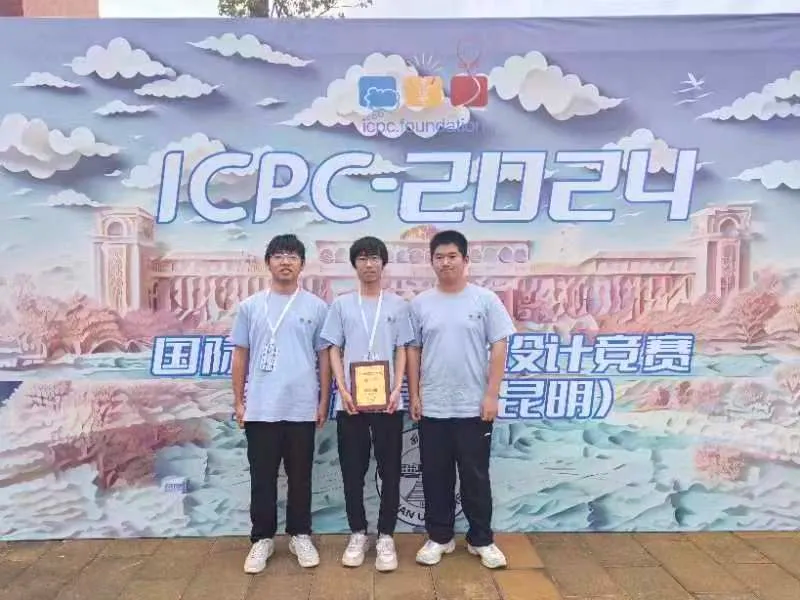

# 2024年5月26日，ICPC国际大学生程序设计竞赛全国邀请赛（昆明）
**作者：王晓丽
发表时间：2024-05-28**

2024年5月26日，ICPC国际大学生程序设计竞赛全国邀请赛（昆明）在云南大学落下帷幕，来自全国150所高校的264支正式参赛队伍展开激烈角逐。宁波大学信息学院程序设计学会会员李浩、沈天佑、吴镇桥经过激烈的算法与程序设计的较量，喜获金奖，彰显了宁大学子努力拼搏、追求卓越的精神风貌。

国际大学生程序设计竞赛（International Collegiate Programming Contest，简称ICPC）是世界上规模最大、水平最高的国际大学生程序设计竞赛之一。经过五十余年的发展，ICPC赛事已经成为全球最具影响力的大学生计算机竞赛，被誉为计算机软件领域的奥林匹克。比赛旨在提升算法设计、逻辑推理、数学建模、编程实现和计算机系统能力，培养团队合作意识、挑战精神和创新能力。各赛站参赛队伍实力强劲，每场都有约两百多所国内高校参赛，涵盖了几乎全部的“双一流”建设高校。
