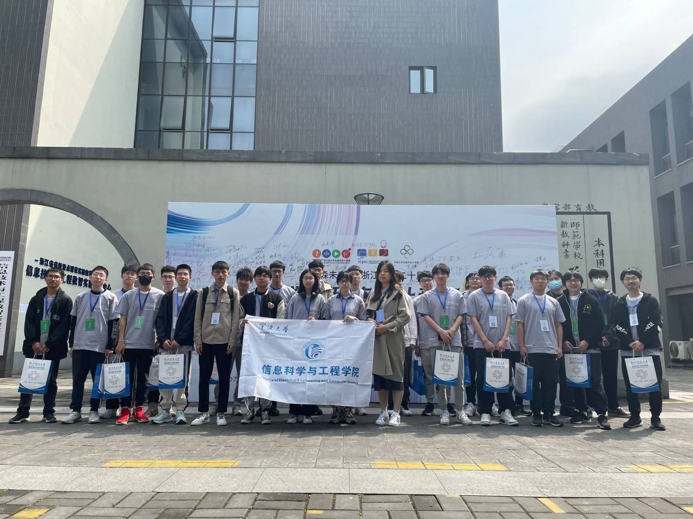
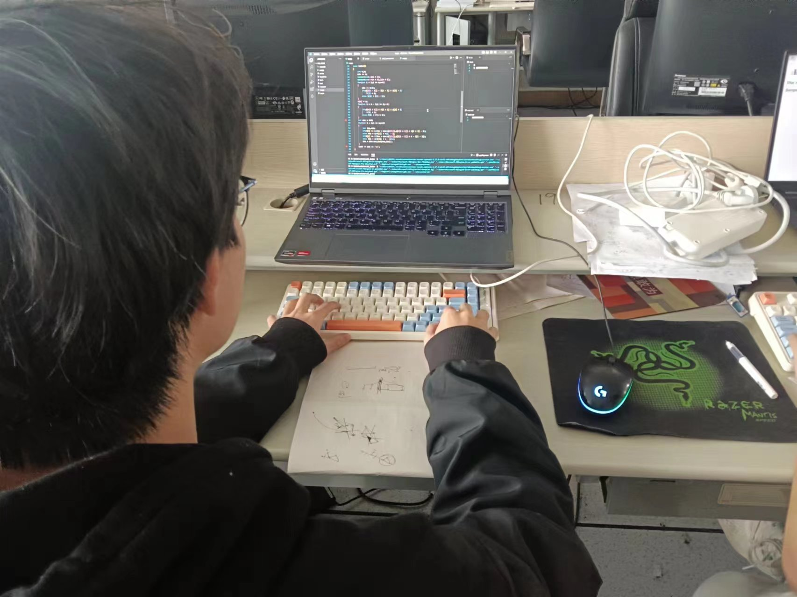
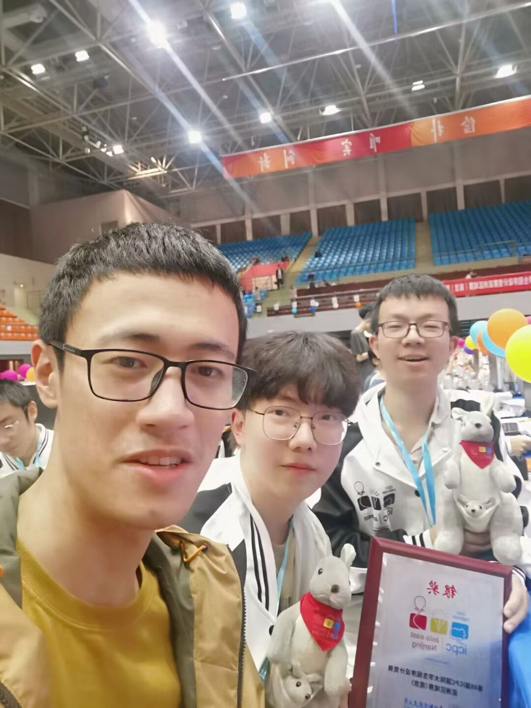
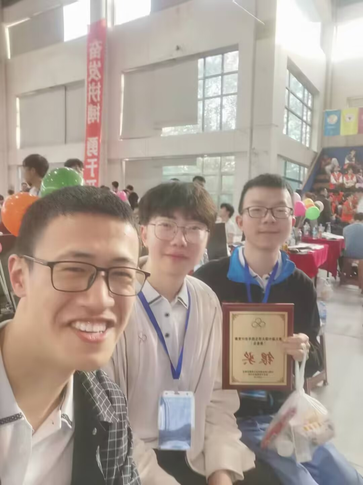

# 主要活动

## 1. 第20届浙江省大学生程序设计竞赛
- **活动时间**: 2023.04.15
- **活动地点**: 杭州师范大学
- **活动负责人**: 陈叶芳
- **活动参加人数**: 25
- **活动内容**:
  大学生程序设计竞赛旨在培养大学生创新思维和运用计算机分析问题、团队协作解决问题的实际能力，激发学生对计算机算法、编程的学习兴趣，提升大学生综合素质。在2023年4月15日，李国庆老师和罗思惠老师带领我们ACM程序设计协会全体成员，前往杭州师范大学参加第20届浙江省大学生程序设计竞赛。最终我们斩获了银奖2项，铜奖3项。
- **活动照片**:

  

- **活动影响**:
  [2023.04.23 活动报道](https://eecs.nbu.edu.cn/info/1230/7302.htm)

## 2. 宁波大学第二十届大学生程序设计竞赛
- **活动时间**: 2023.05.14
- **活动地点**: 宁波大学严信才楼
- **活动负责人**: 陈叶芳
- **活动参加人数**: 25
- **活动内容**:
  2023年5月14日，由教务处主办、信息科学与工程学院承办的宁波大学第二十届大学生程序设计竞赛在东校区严信才实验楼顺利举行。我们ACM程序设计协会全员参加，由会长李嘉琪组织命题。此次比赛共有来自全校各个学院的共100支队伍近300位同学参赛，旨在培养大学生创新思维和运用计算机分析问题、团队协作解决问题的实际能力，激发学生对计算机算法、编程的学习兴趣，提升大学生综合素质。
- **活动照片**:
  
- **活动影响**:
  [2023.05.18 活动报道](https://eecs.nbu.edu.cn/info/1230/7866.htm)

## 3. 2023ACM暑期集训
- **活动时间**: 2023.07.15-2023.08.17
- **活动地点**: 宁波大学严信才楼
- **活动负责人**: 陈叶芳
- **活动参加人数**: 28
- **活动内容**:
  本次暑期集训，旨在提高我们全体创新思维和运用计算机分析问题、团队协作解决问题的实际能力，为即将到来的CCPC、ICPC等赛事做好准备。我们参加了2023牛客暑期多校训练营和2023“钉耙编程”中国大学生算法设计超级联赛共计20场比赛。整个集训流程为，每周一、周二、周四、周五，各参加一场时长5个小时的比赛，周三和周六进行补题和交流。最后，我们全体成员参加了CCPC网络赛作为本次活动的收尾。
- **活动照片**:
  
- **活动影响**:
  [2023.08.17 活动报道](https://eecs.nbu.edu.cn/info/1230/7866.htm)

## 4. CCPC、ICPC等赛事
- **活动时间**: 2023.10.14-2023.12.10
- **活动地点**: 各大承办比赛高校
- **活动负责人**: 陈叶芳
- **活动参加人数**: 25
- **活动内容**:
  CCPC、ICPC等赛事致力于用计算机解决现实世界的问题，以此培养大学生合作、创造、创新以及承受挑战的能力。我们协会成员在这个赛季每周三周六都会到严信才楼进行集中训练，以保持良好的状态，也有效提高了我们的思维能力。
- **活动照片**:
  
  
  
- **活动影响**:

  [2023.10.17 活动报道](https://www.neuq.edu.cn/info/1105/10004.htm)

  [2023.10.26 活动报道](https://www.nwpu.edu.cn/info/1198/72988.htm)

  [2023.11.03 活动报道](https://baijiahao.baidu.com/s?id=1781527202608109401&wfr=spider&for=pc)
