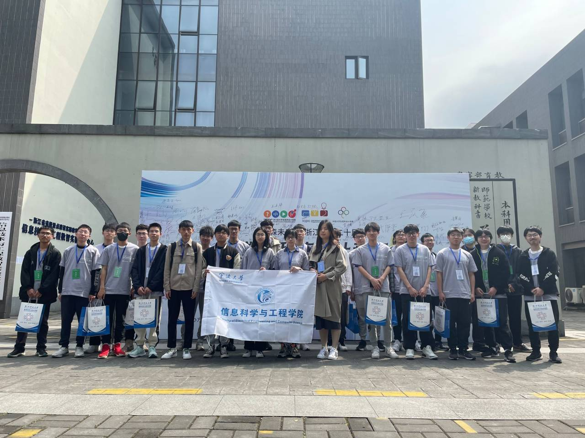
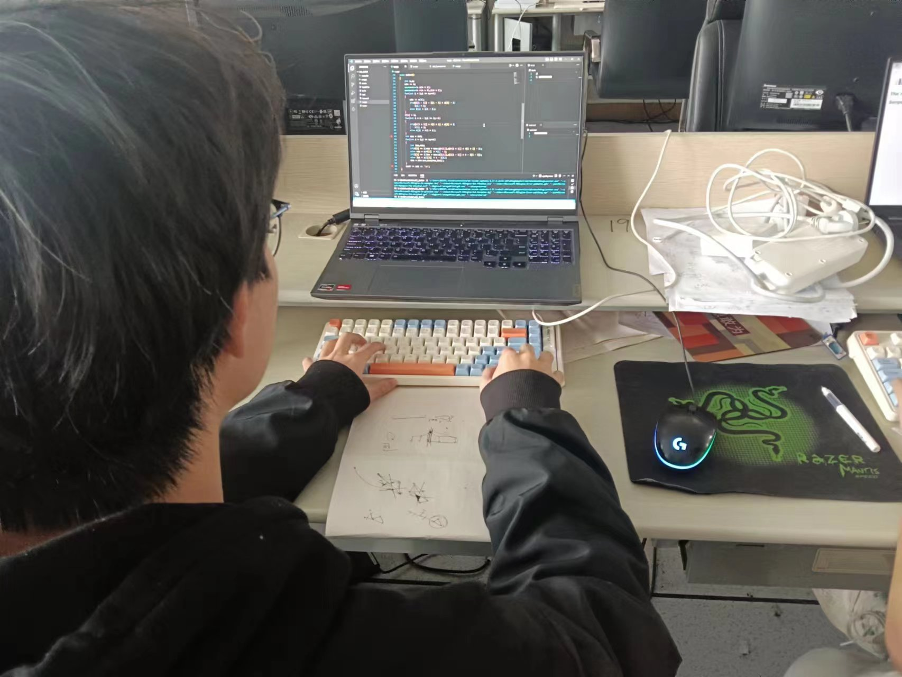
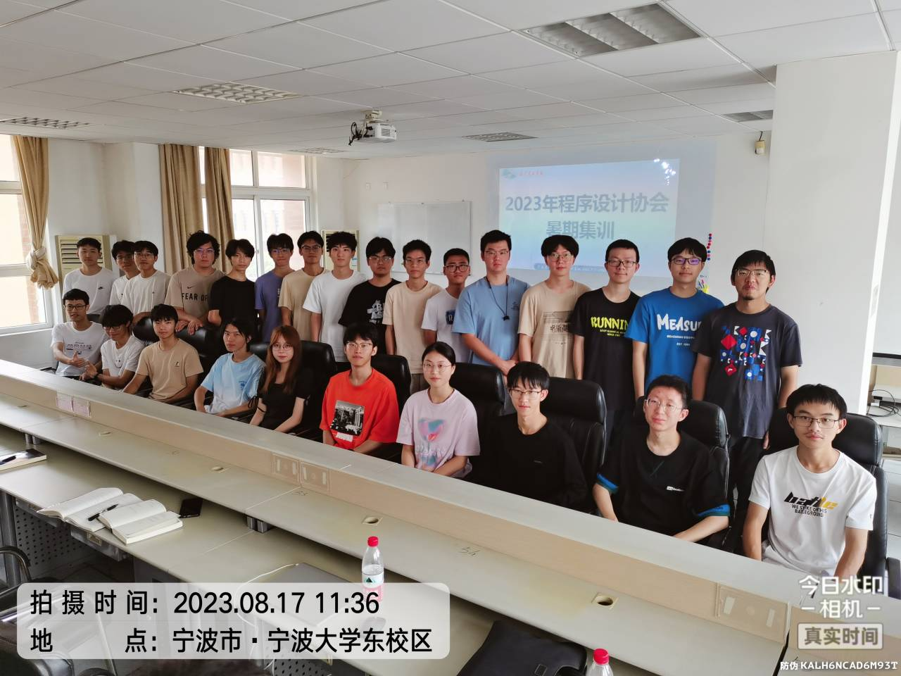
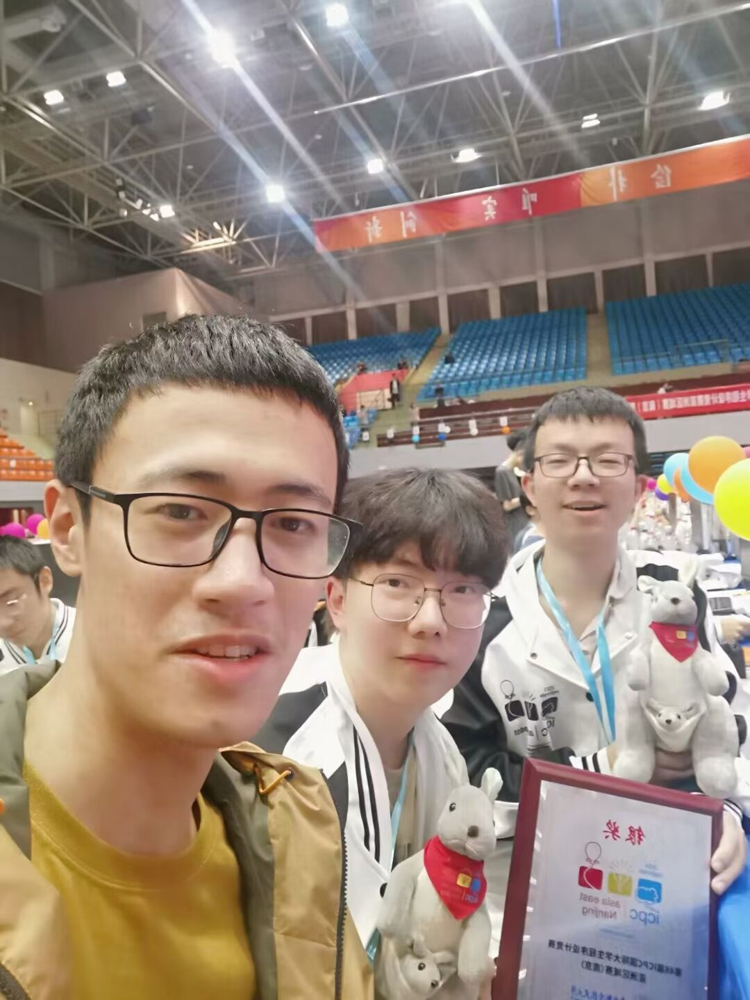
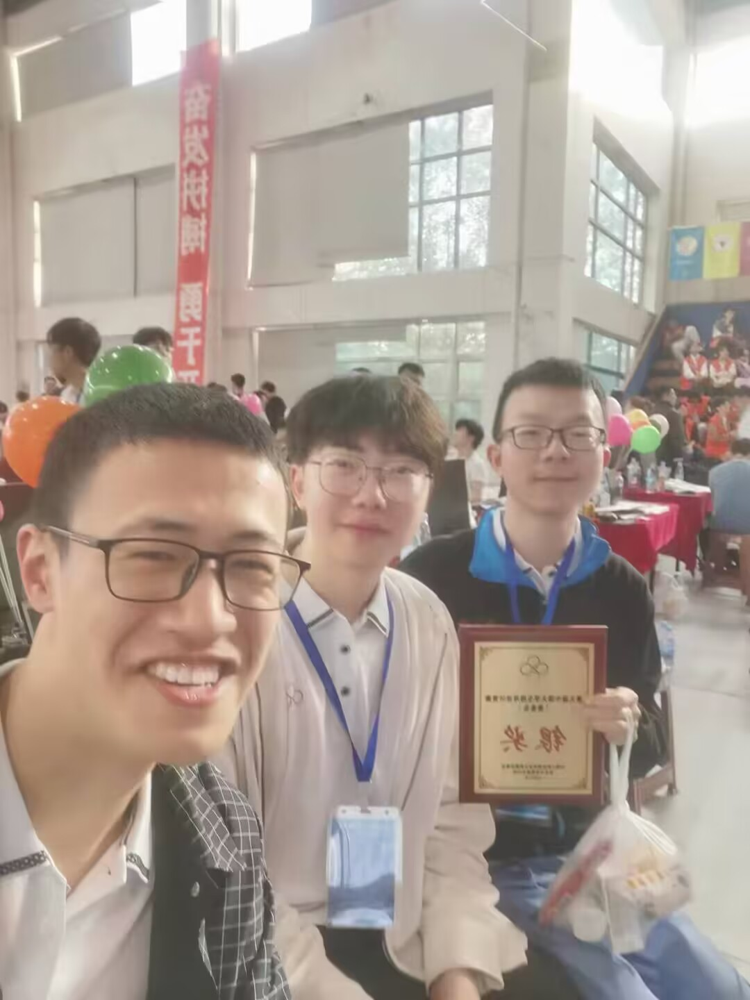
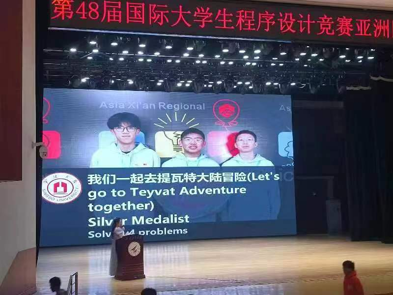

# 宁波大学ACM程序设计协会

## 协会简介

宁波大学ACM程序设计协会是由一群对计算机科学和编程充满热情的学生组成的学术社团。协会致力于提高成员的算法设计能力、编程技能和团队合作精神，积极参与并组织各类程序设计竞赛。我们的目标是培养创新思维和实际解决问题的能力，促进计算机科学知识的传播和应用。

## 主要活动

### 1. 第20届浙江省大学生程序设计竞赛
- **活动时间**: 2023.04.15
- **活动地点**: 杭州师范大学
- **活动负责人**: 陈叶芳
- **活动参加人数**: 25
- **活动内容**:
  大学生程序设计竞赛旨在培养大学生创新思维和运用计算机分析问题、团队协作解决问题的实际能力，激发学生对计算机算法、编程的学习兴趣，提升大学生综合素质。在2023年4月15日，李国庆老师和罗思惠老师带领我们ACM程序设计协会全体成员，前往杭州师范大学参加第20届浙江省大学生程序设计竞赛。最终我们斩获了银奖2项，铜奖3项。
- **活动照片**:

  

- **活动影响**:
  [2023.04.23 活动报道](https://eecs.nbu.edu.cn/info/1230/7302.htm)

### 2. 宁波大学第二十届大学生程序设计竞赛
- **活动时间**: 2023.05.14
- **活动地点**: 宁波大学严信才楼
- **活动负责人**: 陈叶芳
- **活动参加人数**: 25
- **活动内容**:
  2023年5月14日，由教务处主办、信息科学与工程学院承办的宁波大学第二十届大学生程序设计竞赛在东校区严信才实验楼顺利举行。我们ACM程序设计协会全员参加，由会长李嘉琪组织命题。此次比赛共有来自全校各个学院的共100支队伍近300位同学参赛，旨在培养大学生创新思维和运用计算机分析问题、团队协作解决问题的实际能力，激发学生对计算机算法、编程的学习兴趣，提升大学生综合素质。
- **活动照片**:
  
- **活动影响**:
  [2023.05.18 活动报道](https://eecs.nbu.edu.cn/info/1230/7866.htm)

### 3. 2023ACM暑期集训
- **活动时间**: 2023.07.15-2023.08.17
- **活动地点**: 宁波大学严信才楼
- **活动负责人**: 陈叶芳
- **活动参加人数**: 28
- **活动内容**:
  本次暑期集训，旨在提高我们全体创新思维和运用计算机分析问题、团队协作解决问题的实际能力，为即将到来的CCPC、ICPC等赛事做好准备。我们参加了2023牛客暑期多校训练营和2023“钉耙编程”中国大学生算法设计超级联赛共计20场比赛。整个集训流程为，每周一、周二、周四、周五，各参加一场时长5个小时的比赛，周三和周六进行补题和交流。最后，我们全体成员参加了CCPC网络赛作为本次活动的收尾。
- **活动照片**:
  
- **活动影响**:
  [2023.08.17 活动报道](https://eecs.nbu.edu.cn/info/1230/7866.htm)

### 4. CCPC、ICPC等赛事
- **活动时间**: 2023.10.14-2023.12.10
- **活动地点**: 各大承办比赛高校
- **活动负责人**: 陈叶芳
- **活动参加人数**: 25
- **活动内容**:
  CCPC、ICPC等赛事致力于用计算机解决现实世界的问题，以此培养大学生合作、创造、创新以及承受挑战的能力。我们协会成员在这个赛季每周三周六都会到严信才楼进行集中训练，以保持良好的状态，也有效提高了我们的思维能力。
- **活动照片**:
  
  
  
- **活动影响**:

  [2023.10.17 活动报道](https://www.neuq.edu.cn/info/1105/10004.htm)

  [2023.10.26 活动报道](https://www.nwpu.edu.cn/info/1198/72988.htm)

  [2023.11.03 活动报道](https://baijiahao.baidu.com/s?id=1781527202608109401&wfr=spider&for=pc)

## 比赛介绍

### ICPC (国际大学生程序设计竞赛)
ICPC，全称为国际大学生程序设计竞赛，是全球规模最大、水平最高的大学生程序设计竞赛之一。竞赛旨在培养大学生的编程能力和团队合作精神，挑战他们在规定时间内解决复杂问题的能力。每年，来自全球的大学生队伍通过区域赛选拔，最终角逐全球总决赛。

### CCPC (中国大学生程序设计竞赛)
CCPC，全称为中国大学生程序设计竞赛，是中国大陆地区的高水平程序设计赛事。竞赛致力于提高大学生的算法设计和编程能力，促进高校之间的学术交流。CCPC与ICPC相似，但更具本土特色，许多中国高校都积极参与其中。

### 浙江省程序设计大赛
浙江省程序设计大赛是浙江省范围内的大学生程序设计竞赛，旨在培养大学生的创新思维和编程能力。竞赛内容涵盖了数据结构、算法设计和实际编程等多个方面，为省内高校学生提供了一个展示和交流的平台。

### 蓝桥杯
蓝桥杯全国软件和信息技术专业人才大赛是一项全国性的信息技术竞赛，涵盖了程序设计、软件开发、嵌入式开发等多个领域。竞赛分为校赛、省赛和全国总决赛，旨在通过比赛选拔和培养优秀的IT人才。

### 天梯赛
天梯赛，全称为全国大学生程序设计天梯赛，是一项面向全国高校学生的编程竞赛。竞赛采用个人赛和团队赛相结合的形式，考察选手的编程能力、算法设计能力和问题解决能力。通过竞赛，学生们不仅能提升自己的技能，还能与来自全国各地的优秀选手交流学习。

## ACM训练内容

### 学习内容
我们的训练内容涵盖了算法和数据结构的方方面面，包括但不限于：
- **基础算法**: 排序算法、搜索算法、图算法等
- **高级算法**: 动态规划、贪心算法、分治算法等
- **数据结构**: 数组、链表、栈、队列、树、图、哈希表等
- **专题训练**: 字符串处理、数论、几何算法等

## 学习资源推荐

### 在线平台

- **[LeetCode](https://leetcode.com/)**: 一个非常受欢迎的在线编程平台，提供大量的算法和数据结构问题，适合从基础到进阶的练习。题目分类明确，支持多种编程语言。

- **[HackerRank](https://www.hackerrank.com/)**: 提供多种编程挑战，从算法、数据结构到数学、数据库等多领域的练习。支持多种编程语言，并有详尽的讨论区和解题报告。

- **[Codeforces](https://codeforces.com/)**: 一个面向竞赛编程的在线平台，提供丰富的编程比赛和训练题目。适合参加ICPC、CCPC等竞赛的训练。

- **[AtCoder](https://atcoder.jp/)**: 日本的一个编程竞赛平台，提供高质量的竞赛和题目，题目难度范围广，从入门到高级都有。

- **[TopCoder](https://www.topcoder.com/)**: 一个老牌的编程竞赛平台，提供多种编程挑战和竞赛。包括单人比赛、团队比赛以及马拉松比赛。

- **[Kaggle](https://www.kaggle.com/)**: 主要面向数据科学和机器学习的竞赛平台，但也有许多编程和算法挑战。适合想要在数据分析和机器学习领域有所发展的同学。

### 教育平台

- **[Coursera](https://www.coursera.org/)**: 提供多种计算机科学课程，包括算法和数据结构的专业课程。推荐《Algorithms Specialization》系列课程。

- **[edX](https://www.edx.org/)**: 提供来自顶尖大学的在线课程，许多关于算法和数据结构的课程都非常高质量。

- **[MIT OpenCourseWare](https://ocw.mit.edu/)**: 麻省理工学院的开放课程网站，提供许多计算机科学的课程材料。推荐《Introduction to Algorithms》课程。

### 编程练习和竞赛

- **[SPOJ (Sphere Online Judge)](https://www.spoj.com/)**: 一个在线编程练习平台，拥有大量经典问题和竞赛题目。

- **[UVa Online Judge](https://onlinejudge.org/)**: 提供大量编程竞赛题目，适合参加ACM ICPC等竞赛的训练。

- **[CSES Problem Set](https://cses.fi/problemset/)**: 由芬兰计算机科学教育委员会开发，提供高质量的算法和数据结构问题。

- **[LintCode](https://www.lintcode.com/)**: 提供多种编程挑战，特别适合面试准备和刷题。

### 其他资源

- **[GeeksforGeeks](https://www.geeksforgeeks.org/)**: 一个非常全面的计算机科学学习资源网站，提供详细的算法和数据结构教程、面试经验分享以及编程题目解析。

- **[Brilliant](https://www.brilliant.org/)**: 提供互动式的学习体验，涵盖算法、数据结构、数学等多个领域，适合系统性学习和思维训练。

- **[Exercism](https://exercism.io/)**: 提供多种编程语言的练习题目，通过 mentor 的反馈和指导帮助提升编程技能。

- **[OI-Wiki](https://oi-wiki.org/)**: 一个面向编程竞赛的中文知识库，涵盖了算法、数据结构、编程技巧等多个方面。内容详尽，适合备战各类编程竞赛以及学习和复习相关知识。

通过这些资源，你可以系统地学习算法和数据结构，提升编程能力，并为各种编程竞赛做好准备。

## 社团宗旨

宁波大学ACM程序设计协会以提升学生的编程水平和团队合作能力为宗旨，通过组织和参与各类编程竞赛、集训和学术活动，激发同学们对计算机科学的兴趣和热情。协会不仅关注竞赛成绩，更注重培养成员的综合素质和实际应用能力。

## 加入我们

如果你对计算机编程充满热情，想要提升自己的算法设计能力，参与各类程序设计竞赛，欢迎加入宁波大学ACM程序设计协会。我们期待你的加入，与我们一同挑战自我，共同进步！

---

以上内容即为宁波大学ACM程序设计协会的社团介绍。通过这些活动和努力，我们不断提升自身能力，并在各类比赛 中取得优异成绩。期待更多志同道合的小伙伴加入我们，共同创造更多精彩！
