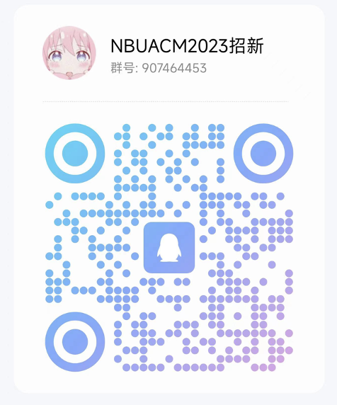

# 加入我们

## 收获

加入宁波大学ACM程序设计协会，你将获得：

- **计算机思维能力**：培养系统的计算机思维，提升解决复杂问题的逻辑能力。
- **算法应用能力**：掌握各种算法的设计与优化，在实际问题中运用自如。
- **复杂问题建模能力**：学会将现实世界的复杂问题抽象为可解决的计算机模型。
- **编码能力**：提升编写高效、清晰代码的能力，解决高难度编程问题。
- **团队配合能力**：在团队项目中学会协作，提升沟通和合作能力。
- **抗压能力**：在高强度的训练和竞赛中锻炼自己的抗压能力和心理素质。

## 奖项

参与我们的训练和比赛，你将有机会获得以下荣誉：

- **ICPC**：国际大学生程序设计竞赛，享誉全球的顶级赛事。
- **浙江省赛**：省级A类竞赛，展示你的编程实力。
- **团体程序设计天梯赛**：省级B类竞赛，提升团队合作和编程水平。
- **CCPC**：中国大学生程序设计竞赛，全国范围的顶级竞赛。
- **CSP认证**：中国计算机学会程序设计认证，权威的编程能力认证。
- **各类算法竞赛**：丰富的竞赛机会，提升你的实战经验和技术水平。

## 创新学分

参与协会活动和竞赛，你将获得创新学分，助力你的学业发展，不再为学分发愁！

## 筛选过程

### 第一学期

- **题单训练**：通过精心设计的题单进行刷题训练，提升编程基础能力。
- **院赛**：参加院级程序设计比赛，展示你的编程能力和潜力。
- **第一批进入集训队**：表现优异者将有机会进入我们的集训队，接受进一步的专业训练。

### 第二学期

- **校赛**：参与校级程序设计竞赛，进一步筛选优秀人才。
- **天梯赛**：参加团体程序设计天梯赛，提升团队合作和编程能力。
- **CSP认证**：通过CSP认证，证明你的编程实力和技术水平。
- **暑假**：正式入队，参加多校训练营，接受高强度、系统化的训练。

### 第三学期及以后

- **ICPC**：参加国际大学生程序设计竞赛，挑战全球顶级选手。
- **CCPC**：参与中国大学生程序设计竞赛，展示你的编程实力。
- **省赛**：参加浙江省程序设计竞赛，提升和展示你的编程能力。

## 筛选要求

- **自主训练**：通过题单刷题和线上比赛，不断提升自己的编程能力。
  - **题单**：刷题数量将计入最后的选拔成绩。
  - **线上比赛**：在Codeforces、AtCoder等平台参加比赛，积累实战经验。

- **线下选拔赛**：通过多种线下比赛进行严格选拔。
  - **院赛**：参加院级比赛，展示你的编程实力。
  - **校赛**：参与校级比赛，进一步提升和展示你的能力。
  - **其他线下赛**：包括待定的其他线下选拔赛，提升综合能力。

## 入门资源

- **NBU-ACM新生入门过渡题单**：通过Virtual Judge ([viudge.net](https://www.viudge.net))进行题目练习。
- **Vjudge入门题单使用方法**：详见PDF文档，帮助你快速上手。
- **入门训练经验**：由[ZWH提供的详细PDF文档](/resource/guide.md)，分享宝贵的训练经验和技巧。

## 学习资源推荐

### 在线平台

- **[LeetCode](https://leetcode.com/)**：提供大量算法和数据结构问题，适合从基础到进阶的练习。
- **[HackerRank](https://www.hackerrank.com/)**：多领域编程挑战，支持多种编程语言。
- **[Codeforces](https://codeforces.com/)**：竞赛编程平台，提供丰富的编程比赛和训练题目。
- **[AtCoder](https://atcoder.jp/)**：日本的编程竞赛平台，题目质量高，难度覆盖广泛。
- **[TopCoder](https://www.topcoder.com/)**：老牌竞赛平台，提供多种编程挑战和比赛。
- **[Kaggle](https://www.kaggle.com/)**：数据科学和机器学习竞赛平台，也有编程和算法挑战。

### 教育平台

- **[Coursera](https://www.coursera.org/)**：提供专业的计算机科学课程，包括算法和数据结构。
- **[edX](https://www.edx.org/)**：顶尖大学的在线课程，高质量的算法和数据结构课程。
- **[MIT OpenCourseWare](https://ocw.mit.edu/)**：麻省理工学院的开放课程，推荐《Introduction to Algorithms》。

### 编程练习和竞赛

- **[SPOJ (Sphere Online Judge)](https://www.spoj.com/)**：经典问题和竞赛题目，适合系统性练习。
- **[UVa Online Judge](https://onlinejudge.org/)**：提供大量编程竞赛题目，适合ACM ICPC训练。
- **[CSES Problem Set](https://cses.fi/problemset/)**：高质量的算法和数据结构问题。
- **[LintCode](https://www.lintcode.com/)**：面试准备和刷题的好平台。

### 其他资源

- **[GeeksforGeeks](https://www.geeksforgeeks.org/)**：全面的计算机科学学习资源，详尽的教程和解析。
- **[Brilliant](https://www.brilliant.org/)**：互动式学习平台，涵盖算法、数据结构、数学等。
- **[Exercism](https://exercism.io/)**：多种编程语言练习题目，通过 mentor 的反馈提升技能。
- **[OI-Wiki](https://oi-wiki.org/)**：中文知识库，涵盖算法、数据结构、编程技巧等，适合竞赛准备。

## 加入我们

### 报名表和交流群

- **报名表**：请扫描下方二维码填写报名表，加入我们！

- **交流群**：扫码加入我们的交流群，了解更多信息！

期待你的加入，共同创造更多精彩和辉煌！
